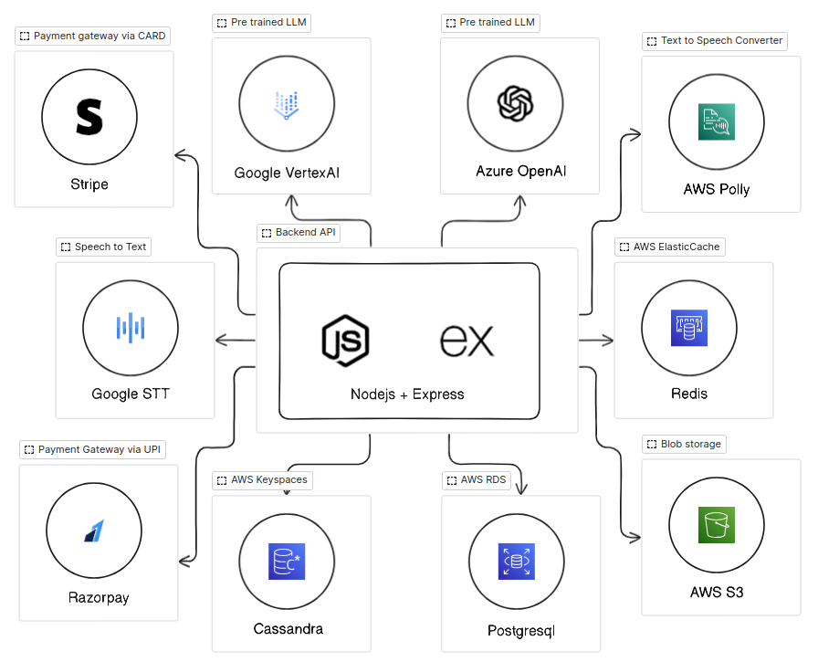
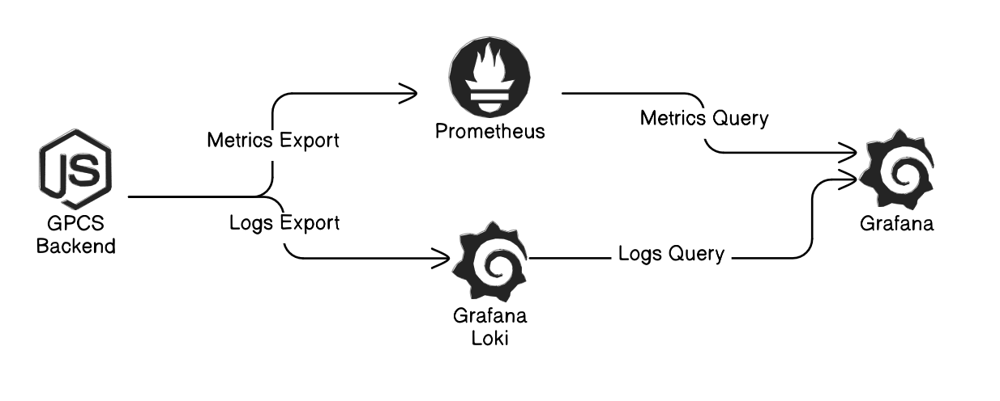

# GPCS Backend


<div align="center">


<small>( Image generated by Gemini-pro )</small>

</div>

# Description

GPCS (General Purpose Chat System) API is an AI powered chat system that allows
users to interact with a chatbot. The chatbot is capable of answering questions,
providing information, and making recommendations. The chatbot is powered by
Google's Generative AI model ( Gemini-pro )

This API is built with cloud driven approach in mind, it uses AWS S3 for storing
files, AWS Polly for text-to-speech, GCP Vertex AI ( Multimodal text, image,
audio, video, PDF, code, and chat ) for chatbot, GCP Speech API for
speech-to-text, Stripe and Razorpay for payment processing and websockets for
real-time chat communication ( Between users and chatbot only )

# Features

- User authentication
- AI powered chatbot
- Voice interaction with the chatbot
- Hybrid payment system (Stripe and Razorpay)
- Real-time chat through websockets

# Requirements

<div align="center" style="margin-bottom: 20px">

</div>

- [NodeJS](https://nodejs.org/en/download) ( v20.6.x or above )
- [AWS S3](https://aws.amazon.com/s3/)
- [AWS RDS](https://aws.amazon.com/rds/)
- [AWS Polly](https://aws.amazon.com/polly/)
- [AWS Keyspaces](https://aws.amazon.com/keyspaces/)
- [AWS Secrets Manager](https://aws.amazon.com/secrets-manager/)
- [GCP Vertax API](https://cloud.google.com/vertex-ai?hl=en)
- [GCP Speech API](https://cloud.google.com/speech-to-text)
- [Stripe API](https://docs.stripe.com/api)
- [Razorpay API](https://razorpay.com/docs/api/)
- [Docker](https://www.docker.com/) ( Optional but recommended )

# Deployment Diagram

<div align="center" style="margin-bottom: 20px">

</div>

This diagram illustrates the deployment architecture of the GPCS API. The API
deployment architecture is designed to be scalable, fault-tolerant and most
importantly secure infrastructure.

To achieve this, I preferred to use AWS Elastic Container Service (ECS) with
Fargate launch type. This allows me to run the API in a containerized
environment without worrying about the underlying infrastructure.

The reason of choosing ECS over EC2 is because ECS is a fully managed container
orchestration service that allows me to run, stop, and manage Docker containers
on a cluster. It also provides features like auto-scaling, load balancing, and
monitoring.

All this advantages comes with relatively less efforts to manage and worry about
infra and security which helps me to be more productive.

# Installation

1. Clone the repository

```bash
git clone https://github.com/vinitparekh17/gpcs
```

2. Install dependencies

```bash
yarn install
```

3. Create a `.env` file in the root directory as per the `.env.example` file

```bash
cp .env.example .env
```

4. Start the server

```bash
yarn server-dev # For development

yarn build && yarn start # For production
```

# Run with Docker

1. Build the Docker image

```bash
docker build -t gpcs -f ./docker .
```

2. Run the Docker container

```bash
docker run -p 8080:8080 gpcs -d --name gpcs
```

# Logging and Monitoring

## Overview

<div align="center" style="margin-bottom: 20px">

</div>

## Components

### Grafana

- Web-based analytics and interactive visualization platform
- Supports multiple data sources
- Provides customizable dashboards for real-time monitoring

### Prometheus

- Open-source systems monitoring and alerting toolkit
- Collects and stores metrics as time-series data
- Supports powerful query language (PromQL)

### Loki

- Lightweight log aggregation system
- Designed for cloud-native environments
- Optimized for storing and querying container logs

## Setup Requirements

- Docker
- Docker Compose
- Minimum system resources:
  - 4 GB RAM
  - 2 CPU cores

## Configuration

1. Install Docker
2. Configure Prometheus targets
3. Set up Loki log collection
4. Configure Grafana data sources
5. Create monitoring dashboards

## Useful Links

- [Grafana Official Site](https://grafana.com/)
- [Prometheus Documentation](https://prometheus.io/docs/)
- [Loki GitHub Repository](https://github.com/grafana/loki)

> [!IMPORTANT]
> Make sure to have MongoDB running on your local machine or provide the
> connection string in the `.env` file <br/> <br/> Also, make sure to have the
> required AWS, GCP, Stripe and Razorpay credentials in the `.env` file which
> are required for the API to work properly.
